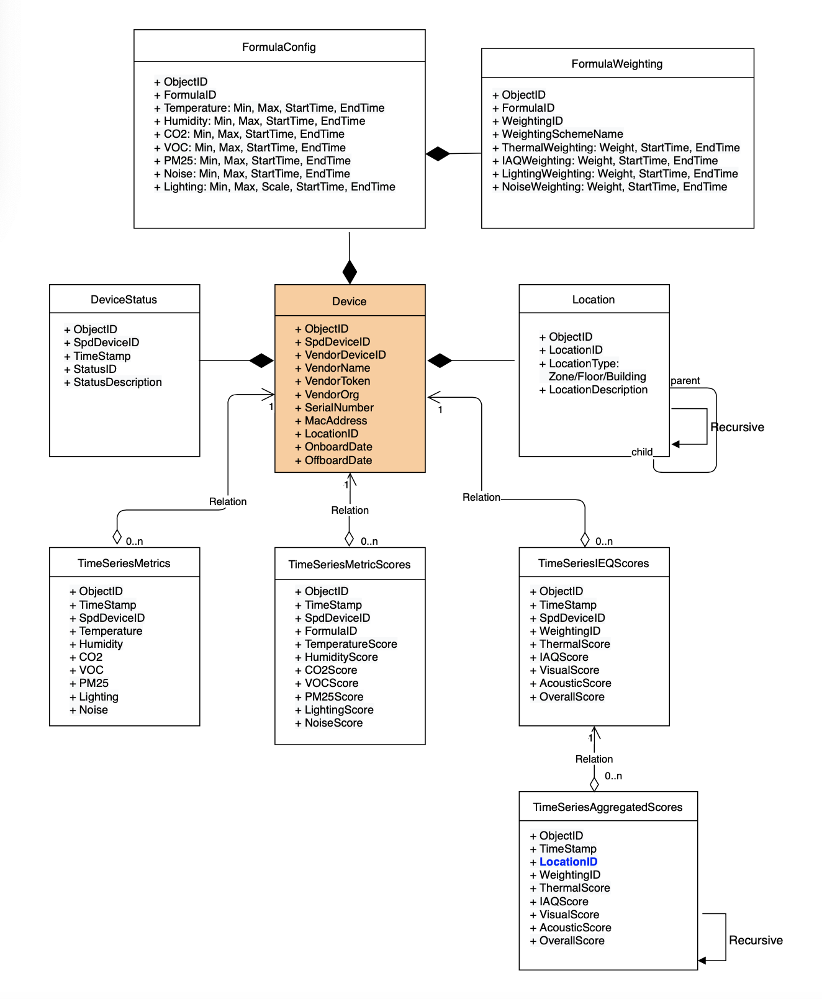

# IEQ POC
This is an implementation of the a IEQ (Indoor Environment Quality) POC as described in [IEQ Confluence Page](https://<TODO>.atlassian.net/wiki/spaces/RND/pages/895942767/IEQ).

## High-level diagram

 

## Build and run

The POC is running at [IEQ-POC-Awair](http://168.63.237.138:8080/ieq/device?device_id=awair-omni_18453) and [IEQ-POC-uHoo](http://168.63.237.138:8080/ieq/device?device_id=uhoo_device).  

There are just 2 processes to run, the **scoreserver** and **frontend**.

To build and run locally, follow these brief steps:  

1. Install postgres.  
2. Setup the database, see **db/postgres** section below.
4. Build run the **scoreserver**, see scoreserver section below.
5. Build and run **frontend**, see frontend section below.

To run the GraphQL sample, see **gqlgen-ieq** section below.  

Implemented primarily in Go, the project's directory structure contains the modules/packages.  
Below outlines and their roles and functionalities.  

## configs
This module contains the formula configurations as explained in [IEQ Confluence Pages](https://<TODO>.atlassian.net/wiki/spaces/RND/pages/911605897/IEQ+Index+Scoring+Methodology).  
Currently a configuration is stored in yaml file and will be read by the application during runtime. (TODO: configuration to be stored and maintained in database). 

Each configuration will be assigned to a IEQ device.  

## db/postgres
This package provides the functionality to create and retrieve record to and from database.  
It contains the set up scripts to create postgres db tables.  
We only require 4 tables for this POC:  
Table | Description
---|---
devicestatus | keeps the latest device status. 
metrics | an append-only table that stores the metrics read by device. In **production**, these should be stored in **time-series database**.  
metricscores | an append-only table that stores the scores calculated by our application. In **production**, these should be stored in **time-series database**.  
ieqscores | an append-only table that stores the scores calculated by our application. In **production**, these should be stored in **time-series database**.  

For now, `db/postgres/connect.go` contains hardcoded database user and database name.  
Run `db/postgres/setup.sh` to create the db tables.  

## formulas
This module contains the implementation of the scoring formulas as explained in [IEQ Confluence Pages](https://<TODO>.atlassian.net/wiki/spaces/RND/pages/911605897/IEQ+Index+Scoring+Methodology).  

Though the IEQ has 7 metrics (temperature, humidity, CO2, VOC, PM2.5, Noise, Lighting), the implementation has been refactored to 3 main types of formulas:  
Formula | Description
---|---
standard.go | used by Temperature and Humdidity to calculate their scores based on Relative Range (closeness or farness) to the recommended range.  
mingood.go | used by CO2, VOC, PM2.5 and Noise to calculate their scores based on "minimum is good", hence "mingood".  
lighting.go | used by Lighting to calculate its score based directly on Lux Scale recommended by Singapore Standards for building office environment. Each Lux Scale has Lux range associated with a score.  

## frontend
A sample frontend web server serving the IEQ html charts **gotemplates**.  
Build and run the binary:  
```sh
go build -o frontend main.go
```
```sh
./frontend 8081
```

Once up and running, you can use web browser to browse to:  
`http://localhost:8081/ieq/device?device_id=awair-omni_18453`  
`http://localhost:8081/ieq/device?device_id=uhoo_device`  

## gotemplates
Contains the html, css, js for rendering IEQ Rating and Scores in [Chart.js](https://www.chartjs.org/).  

## gqlgen-ieq
A sample GraphQL server follows the steps from [gqlgen getting started](https://gqlgen.com/getting-started/). 
You may have to do a fresh `go mod init` in your own directory.   
Then re-generate GraphQL codes:  
```sh
$ go generate ./...
```
And start our GraphQL playground to test below queries.  
```
$ go run server.go 
2021/02/24 14:04:00 connect to http://localhost:8080/ for GraphQL playground
```

It provide below queries to retrieve from database a device's latest metrics, calculated metrics scores, and calculated IEQ scores:  
Get latest metrics by device ID:  
```graphql
query getMetrics {
  latestmetrics(deviceId:"awair-omni_18453") {
    deviceId
    timestamp
    temperature
    humidity
    co2
    voc
    pm25
    noise
    lighting
  }
}
```
Response:  
```json
{
  "data": {
    "latestmetrics": {
      "deviceId": "awair-omni_18453",
      "timestamp": "2021-02-23T10:55:09+08:00",
      "temperature": 29.239999771118164,
      "humidity": 59.810001373291016,
      "co2": 410,
      "voc": 88,
      "pm25": 9,
      "noise": 54.70000076293945,
      "lighting": 144.89999389648438
    }
  }
}
```
Get latest metrics scores by device ID:  
```graphql
query getMetricScores {
  latestmetricscores(deviceId:"awair-omni_18453") {
    deviceId
    timestamp
    temperature
    humidity
    co2
    voc
    pm25
    noise
    lighting
  }
}
```
Response:  
```json
{
  "data": {
    "latestmetricscores": {
      "deviceId": "awair-omni_18453",
      "timestamp": "2021-02-23T10:55:09+08:00",
      "temperature": 50,
      "humidity": 100,
      "co2": 100,
      "voc": 100,
      "pm25": 100,
      "noise": 90,
      "lighting": 62.5
    }
  }
}
```
Get latest IEQ scores by device ID:  
```graphql
query getIeqScores {
  latestieqscores(deviceId:"awair-omni_18453") {
    deviceId
    timestamp
    scheme
    thermal
    thermalweighting
    iaq
    iaqweighting
    lighting
    lightingweighting
    noise
    noiseweighting
    overall
  }
}
```
Response:  
```json
{
  "data": {
    "latestieqscores": {
      "deviceId": "awair-omni_18453",
      "timestamp": "2021-02-23T10:55:09+08:00",
      "scheme": "IEQ-CUSTOM",
      "thermal": 12.5,
      "thermalweighting": 25,
      "iaq": 20,
      "iaqweighting": 0,
      "lighting": 13.75,
      "lightingweighting": 22,
      "noise": 29.7,
      "noiseweighting": 33,
      "overall": 75.95
    }
  }
}
```

## interfaces
This package contains the various interfaces with concrete implementation by other packages.  
1. device.go - implemented by **sensors** package that talks directly to vendor APIs.  
2. executable.go - implemented by **tasks** package to provide executable tasks.  
3. rateable.go - implemented by **ratings** package to provide objects that can be rated based on a weighting.
4. scorer.go - implemented by **formulas** package to provide objects that can compute a score.
5. stringer.go - just a general interface for objects providing ToString() functionality.

## models
This package provides a common data models used by all packages.  
The common data models typically maps to their respective database tables:  
Model | Description
---|---
device | contains the fields for a device.  
metrics | contains fields for the 7 metrics Temperature, Humidity, CO2, VOC, PM2.5, Noise, Lighting.  
metricscores | contains fields for the scores of the 7 metrics.  
ieqscores | contains fields for the IEQ scores and overall rating.  

## ratings
This package provide the functionality to compute IEQ ratings for:  
1. Thermal = Temperature + Humidity. 
2. IAQ = CO2 + VOC + PM2.5. 
3. Noise. 
4. Lighting. 

Also, the Overall Rating is computed based on Weightings associated to Thermal, IAQ, Noise and Lighting.

## scoreserver
This package provides the a sample backend server process to periodically read metrics from device, computes can stores the scores in database.  
The tasks intervals are currently stored in each device yaml config file. In production, device config would be stored in the database.  
Build the server.go and run as a single binary.  
```sh
go build -o server server.go
```
```sh
./server
```

By default, scoring tasks are started at the 5th minutes of the hour, e.g. 5, 10, 15, 20...  
```sh
2021/02/24 13:31:44 Waiting to start awair-omni_18453 task...24/02/2021 13:31:44
2021/02/24 13:31:44 Waiting to start uhoo_device task...24/02/2021 13:31:44
2021/02/24 13:31:45 Waiting to start awair-omni_18453 task...24/02/2021 13:31:45
2021/02/24 13:31:45 Waiting to start uhoo_device task...24/02/2021 13:31:45
```

## sensors
This package provides the functionality to invoke and retrieve metrics readings from respective sensors via vendor APIs.  
Awair and uHoo devices are currently supported.  

## tasks
This package provides the abstractions for executable tasks. The server process typically executes these tasks periodically.  
Currently the primary task is to compute and store devices' scores at configured intervals.  

## utils
This package provides common utilities functions used by various packages.  
The most important utility to note is the use of skiptree data structure by **formulas** package.  
Skiptree is a tree data structure that provides range searching algorithm.  
Our formulas structures are still small. For large tree structure efficiency, it is important to keep the tree balanced when creating the tree.  

## TODOs - Detail Design for IEQ Device Management and Data Ingestion
Do note below provides a more complete design required by an IEQ device.  
These are to be reviewed before development.  

### Device Data Model
 


